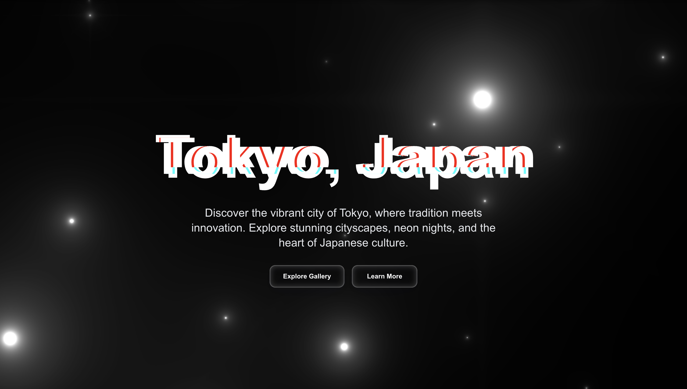

# 🌟 Tokyo Experience - Fluid Glass & Iridescence Web

> **An immersive Tokyo-themed website featuring fluid glass effects, iridescence backgrounds, and interactive 3D experiences built with modern web technologies.**

[](https://nextjs.org/)
[](https://reactjs.org/)
[](https://www.typescriptlang.org/)
[](https://threejs.org/)
[](https://tailwindcss.com/)

## 📸 Live Preview

<div align="center">
  
  <p><em>Hero section with iridescence background and glitch text effects</em></p>
</div>

## 🚀 Features

### ✨ **Core Features**
- **🌈 Interactive Iridescence Background** - Dynamic color-shifting background with mouse interaction
- **💎 Fluid Glass Morphism** - Real-time 3D glass effects with transmission and refraction
- **🎭 Glitch Text Animations** - Cyberpunk-style text effects with chromatic aberration
- **📱 Responsive Design** - Optimized for all devices with size guard protection
- **⚡ Performance Optimized** - Built with Next.js 15 and Turbopack for blazing fast performance
- **🎨 Poppins Typography** - Modern, clean font family for better readability

### 🎨 **Visual Effects**
- **Glass Surface Demo** - Interactive glass morphism controls
- **Masonry Gallery** - Dynamic image layout with hover effects
- **Card Swap Animations** - Smooth transitions between content cards
- **Scroll-triggered Animations** - GSAP-powered reveal effects
- **Text Pressure Effects** - Dynamic typography scaling
- **Splash Cursor** - Interactive cursor effects
- **Initial Loader** - Smooth loading experience

## 🛠️ Tech Stack

### **Frontend Framework**
- **Next.js 15.4.6** - React framework with App Router
- **React 19.1.0** - Latest React with concurrent features
- **TypeScript 5.0** - Type-safe development

### **3D & Graphics**
- **Three.js 0.167.1** - 3D graphics library
- **@react-three/fiber 9.3.0** - React renderer for Three.js
- **@react-three/drei 10.7.3** - Useful helpers for react-three-fiber
- **OGL 1.0.11** - WebGL library for iridescence effects

### **Styling & Animation**
- **Tailwind CSS 3.4.0** - Utility-first CSS framework
- **GSAP 3.12.5** - Professional animation library
- **Maath 0.10.8** - Math utilities for animations
- **Poppins Font** - Modern typography

### **Development Tools**
- **ESLint 9.0** - Code linting
- **Turbopack** - Fast bundler for development
- **Sharp** - Image optimization

## 📱 Device Compatibility

<div align="center">
  
  <p><em>Responsive gallery with masonry layout and hover effects</em></p>
</div>

### **Supported Devices**
- ✅ **Desktop & Laptops** (1024px+ width)
- ✅ **Tablets** (Landscape mode)
- ✅ **High-resolution displays**

### **Size Guard Protection**
The website includes an intelligent size guard that displays a beautiful warning page for unsupported devices, ensuring optimal user experience.

## 🏗️ Project Structure

```
fluid-glass-web/
├── src/
│   ├── app/
│   │   ├── components/
│   │   │   ├── FluidGlass.tsx          # 3D fluid glass effects
│   │   │   ├── Iridescence.tsx         # Interactive iridescence background
│   │   │   ├── Iridescence.css         # Iridescence styles
│   │   │   └── ui/
│   │   │       ├── Hero.tsx            # Hero section with animations
│   │   │       ├── Masonry.tsx         # Dynamic gallery layout
│   │   │       ├── GlassSurfaceDemo.tsx # Interactive glass controls
│   │   │       ├── SizeGuard.tsx       # Device compatibility check
│   │   │       ├── SplashCursor.tsx    # Interactive cursor effects
│   │   │       ├── InitialLoader.tsx   # Loading screen
│   │   │       ├── ScrollEffects.tsx   # GSAP scroll animations
│   │   │       ├── TextPressure.tsx    # Dynamic typography
│   │   │       ├── CardSwap.tsx        # Interactive card animations
│   │   │       ├── ProfileCard.tsx     # Developer profile card
│   │   │       ├── GlitchText.tsx      # Cyberpunk text effects
│   │   │       ├── BlobCursor.tsx      # Blob cursor effects
│   │   │       ├── ImageOptimizer.tsx  # Image optimization
│   │   │       └── PerformanceOptimizer.tsx # Performance monitoring
│   │   ├── globals.css                 # Global styles and animations
│   │   ├── layout.tsx                  # Root layout with Poppins font
│   │   └── page.tsx                    # Main page component
│   └── ...
├── public/
│   ├── assets/3d/                      # 3D models (.glb files)
│   ├── images/                         # Tokyo cityscape images
│   ├── images/optimized/               # Optimized image formats
│   └── readme-image/                   # Documentation screenshots
├── scripts/
│   ├── optimize-images.js              # Image optimization script
│   └── optimize-images.mjs             # Modern image optimization
└── package.json                        # Dependencies and scripts
```

## 🎯 Section Overview

### **1. Hero Section**
<div align="center">
  
</div>

- **Glitch Text Effects** - "Tokyo, Japan" with cyberpunk styling
- **Iridescence Background** - Interactive color-shifting background
- **Call-to-Action Buttons** - Glass morphism buttons with hover effects
- **Responsive Design** - Adapts to all screen sizes

### **2. Text Pressure Section**
- **Dynamic Typography** - "Experience Tokyo" with pressure effects
- **Scroll-triggered Animations** - GSAP-powered reveal effects
- **Responsive Scaling** - Text adapts to viewport size

### **3. Gallery Section**
<div align="center">
  
</div>

- **Masonry Layout** - Dynamic image grid with random heights
- **Hover Effects** - Scale and blur animations on hover
- **Tokyo Cityscapes** - Beautiful images of Tokyo landmarks
- **Lazy Loading** - Performance optimized image loading
- **Multiple Formats** - AVIF, WebP, and JPEG optimization

### **4. About Section**
- **Tokyo Information** - Cultural and historical context
- **Responsive Typography** - Clean, readable text layout
- **Iridescence Integration** - Seamless background integration

### **5. Highlights - Card Swap**
- **Interactive Cards** - Rotating content cards
- **Tokyo Themes** - Cuisine, nightlife, and culture
- **Smooth Transitions** - GSAP-powered card animations

### **6. Glass Surface Demo**
<div align="center">
  
</div>

- **Interactive Controls** - Real-time parameter adjustment
- **Glass Morphism** - Advanced glass effects with controls
- **Live Preview** - See changes instantly
- **Multiple Presets** - Pre-configured glass styles

### **7. Fluid Glass Experience**
<div align="center">
  
</div>

- **3D Glass Lens** - Interactive 3D glass object
- **Tokyo Images** - Background images refracted through glass
- **Mouse Tracking** - Lens follows cursor movement
- **Scroll Integration** - Images scroll behind the glass

### **8. Profile Card**
<div align="center">
  
</div>

- **Developer Information** - Meet the creator
- **Interactive Elements** - Hover effects and animations
- **Professional Design** - Clean, modern card layout

### **9. Footer**
- **Glitch Text** - "Tokyo Experience" with effects
- **Copyright Information** - Professional footer design
- **Iridescence Integration** - Seamless background continuation

## 🚀 Getting Started

### **Prerequisites**
- Node.js 18+ 
- npm or yarn package manager

### **Installation**

```bash
# Clone the repository
git clone https://github.com/yourusername/fluid-glass-web.git
cd fluid-glass-web

# Install dependencies
npm install

# Start development server
npm run dev
```

### **Available Scripts**

```bash
npm run dev              # Start development server with Turbopack
npm run build            # Build for production
npm run start            # Start production server
npm run lint             # Run ESLint
npm run analyze          # Analyze bundle size
npm run optimize-images  # Optimize images for web
npm run performance      # Run Lighthouse performance audit
```

### **Environment Setup**

The project uses Next.js 15 with built-in optimizations. No additional environment variables are required for basic functionality.

## 🎨 Customization

### **Iridescence Background**
Modify `src/app/components/Iridescence.tsx` to adjust:
- Color schemes and hue shifts
- Mouse interaction sensitivity
- Animation speeds and patterns
- Background opacity and blending

### **Glass Effects**
Customize glass morphism in `src/app/components/ui/GlassSurfaceDemo.tsx`:
- Transmission and refraction values
- Color and opacity settings
- Border radius and blur effects

### **Animations**
Adjust GSAP animations in `src/app/components/ui/ScrollEffects.tsx`:
- Reveal timing and easing
- Scroll trigger points
- Animation durations

### **Typography**
The project uses Poppins font family with multiple weights:
- Light (300) - Subtle text elements
- Regular (400) - Body text
- Medium (500) - Emphasis
- Semi-bold (600) - Headings
- Bold (700) - Strong emphasis
- Extra-bold (800) - Hero text
- Black (900) - Maximum impact

## 🌟 Key Features Explained

### **Interactive Iridescence Background**
The iridescence background uses WebGL shaders to create a dynamic color-shifting effect with:
- **Mouse Interaction** - Colors respond to cursor movement
- **Auto-animation** - Continuous color transitions
- **Performance Optimized** - Efficient WebGL rendering
- **Color Variations** - Multiple color schemes and patterns

### **Fluid Glass Morphism**
Advanced glass effects implemented with:
- **Backdrop Blur** - Realistic glass transparency
- **Border Effects** - Subtle glass borders
- **Hover Animations** - Interactive feedback
- **CSS Custom Properties** - Dynamic parameter control

### **Performance Optimizations**
- **Next.js 15** - Latest framework with performance improvements
- **Turbopack** - Fast development bundler
- **Image Optimization** - Automatic image compression with Sharp
- **Code Splitting** - Lazy loading of components
- **Scroll-triggered Animations** - Efficient GSAP usage
- **Font Optimization** - Poppins font with proper loading

### **Image Optimization**
- **Multiple Formats** - AVIF, WebP, and JPEG support
- **Responsive Images** - Automatic size optimization
- **Lazy Loading** - Performance-focused image loading
- **Quality Optimization** - Balanced quality and file size

## 🤝 Contributing

1. Fork the repository
2. Create a feature branch (`git checkout -b feature/amazing-feature`)
3. Commit your changes (`git commit -m 'Add amazing feature'`)
4. Push to the branch (`git push origin feature/amazing-feature`)
5. Open a Pull Request

## 📄 License

This project is licensed under the MIT License - see the [LICENSE](LICENSE) file for details.

## 🙏 Acknowledgments

- **Tokyo Photography** - Beautiful cityscape images
- **Three.js Community** - 3D graphics inspiration
- **GSAP Team** - Amazing animation library
- **Next.js Team** - Excellent React framework
- **Google Fonts** - Poppins typography

## 📞 Contact

- **Project Link**: [fluid-glass-web](https://github.com/danyawn/tokyo-fluid-glass)
<!-- - **Live Demo**: [https://your-domain.com](https://your-domain.com) -->

---

<div align="center">
  <p>Made with ❤️ by Yan Danu, for the Tokyo Experience</p>
  <p><em>Experience the future of web design with fluid glass and iridescence effects</em></p>
</div>
